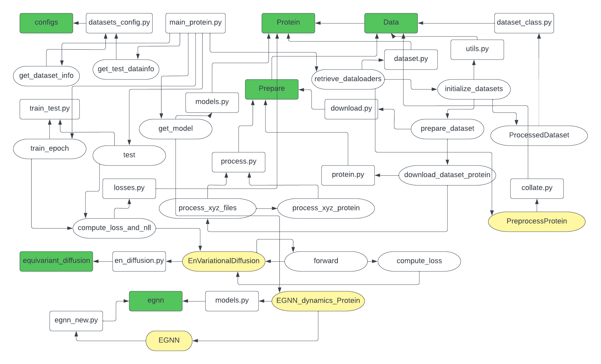

# edm_protein
To run the training program   
Have a folder named DSSPFiles where the dssp files for the protein structures will be stored.  
The dssp file path can be modified in the edm_protein/e3_diffusion_for_proteins/protein/data/prepare/process.py file.  
The protein target names and the number of proteins for each target can be passed as a list in the edm_protein/e3_diffusion_for_proteins/protein/data/prepare/protein.py file. The the size of train, test and validation set can also be defined in the same file.  
The information about the node distribution of the proteins should be provided in the edm_protein/e3_diffusion_for_proteins/datasets_config.py file.   
   
Run the training program   
python3 main_protein.py --n_epochs 20 --exp_name edm_protein --n_stability_samples 1000 --diffusion_noise_schedulepolynomial_2 --diffusion_noise_precision 1e-5 --diffusion_steps 10 --diffusion_loss_type l2 --batch_size 2 --nf 256 --n_layers 9 --lr 1e-4 --normalize_factors [1,4,10]--test_epochs 20 --ema_decay 0.9999
